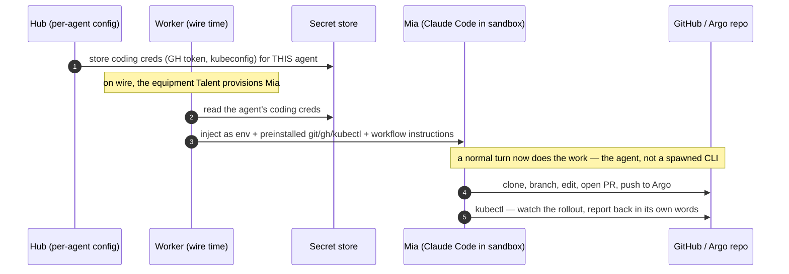

# The coding agent — equipping an agent with Git + cluster access (proposed)

> **Status: design intent, not built.** Captures the shape for an agent (e.g. **Mia**) that changes a
> codebase and ships it — clone a repo, make a change, open a PR, push, and watch it deploy. Recorded
> now so the first build follows a plan instead of an ad-hoc tool drop. Nothing here is wired yet.

---

## The need

Mia's job is to edit a website's repository and get the change to the cluster. Concretely she needs:

- **CLIs** in her sandbox: `git` / `gh`, and `kubectl` (to push to the GitOps/Argo repo and watch the
  rollout).
- **Credentials**: a GitHub token, a kubeconfig — the secrets those CLIs authenticate with.
- **Instructions**: how *this* repo is laid out and how a change reaches production (branch, PR, the
  Argo repo, the deploy to watch). Knowledge, not just tools.

## The key distinction: two Talent shapes

The Plaud Talent and a coding Talent are not the same animal, and conflating them is the trap:

| | **Producer** (Plaud) | **Equipment** (coding) |
|---|---|---|
| Who does the work | the **Talent** — a spawned CLI processes an item and returns an outcome | the **agent itself**, in-session, using Claude Code's own Read/Edit/Bash/git |
| What the Talent provides | a result (`report, don't speak`) | an **environment**: CLIs + credentials + workflow instructions |
| Output | a `TalentOutcome` | none — the agent's normal turn does the pushing |

A coding capability is the **equipment** shape: it does not spawn a CLI and return; it **provisions the
agent** so the agent can do the work with the tools it already drives.

## Recommended design

- **Tools** — the Talent declares the CLIs it needs (`git`, `gh`, `kubectl`). Today: **preinstall**
  them in the sandbox image (fastest, and fine for a single first agent). Later: the runtime installs
  declared tools at wire time, the same GitOps-style unit path Talents already load through.
- **Credentials — per *agent*, not per person.** A coding agent shares **one worker and one
  filesystem**, so everyone talking to Mia shares the same checkout; per-person credentials would be a
  fiction over shared state. So the credential bundle (GitHub token, kubeconfig) is attached to the
  **agent**, stored in the encrypted `secret` store like every other secret, and **injected as env**
  into the agent's runtime at wire time. The manifest declares *which* env vars it needs; the Hub
  collects them through a config form (the same shape as the Slack app-management token form).
- **Instructions** — a Claude Code skill / appended system prompt that teaches the workflow for this
  repo: branch → change → PR → push to the Argo repo → watch the rollout with `kubectl`. This is what
  turns "has git" into "knows how to ship."

## Open questions (deferred, deliberately)

- **Two coding-ish Talents, two different GitHubs.** If an agent ever loads two capabilities that each
  carry GitHub creds, whose token wins? Recommendation: **namespace the env per Talent** (a Talent sees
  only its own secrets), so they never collide — but this is not needed for a single first coding agent.
- **Per-person coding.** Genuinely can't work on a shared worker filesystem — it would need per-person
  **sandboxes / pods** (the A2 isolation trajectory). Out of scope until that lands; coding stays
  per-agent.

_Relates to A2 (the sandbox that would eventually make per-person coding possible) and the Talents
capability plane ([`tonoman-talents.md`](tonoman-talents.md)) whose "equipment" variant this defines._
