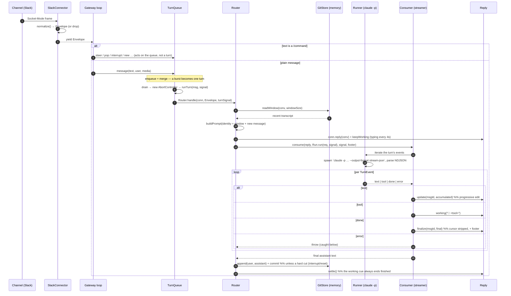

# The messaging gateway turn loop

Some harnesses (Claude Code, codex) have no channel of their own. The **messaging gateway** is the
Tonoman substrate that gives them one: it owns the channels and their credentials, normalizes every
inbound message to a neutral **`Envelope`**, drives the harness **one turn at a time**, and streams
the reply back over an abstract contract — so the router, the memory store, and the stream consumer
carry **zero** channel- or harness-specific code.

This is the feature-level view of architecture.md **§A1** (gateway) and **§A4** (streaming reply). For
the harness command itself see [`auth-and-harness.md`](auth-and-harness.md); for the transcript it
reads and writes see [`git-memory.md`](git-memory.md).

---

## The five participants

| Participant | Contract (`src/core/contracts.ts`) | Job |
|---|---|---|
| **Connector** | `Connector` | Owns one transport. `receive()` yields `Envelope`s; `reply(conv)` opens an outbound handle. (Live: `SlackConnector`.) |
| **Router** | — (`src/router.ts`) | Maps `channel + conversation → agent + session`; owns the per-turn loop. |
| **Turn-runner** | `TurnRunner` | The **only** harness-specific code: runs `claude -p … --output-format stream-json` and yields normalized events. (`Runner`, `src/harness/claudecode.ts`.) |
| **Streamer** | `Streamer` | Reduces the event stream into `send`/`update`/`finalize` calls on the Reply. (`Consumer`, `src/stream.ts`.) |
| **Memory store** | `MemoryStore` | The git-backed JSONL transcript. (`GitStore` — see [`git-memory.md`](git-memory.md).) |

The **channel-abstraction invariant**: a Telegram- or Slack-specific detail leaking into the router,
store, turn-runner, or consumer is a contract defect. Fidelity differences are handled by
*property-named* flags on the streamer (`prefixStream`, `collapsesBlankLines`), never by an `isTeams`
branch in the loop — "one code path, different fidelity."

---

## How one message becomes a reply

On the error path the router never goes silent: an auth failure posts the connect notice, a stale
`--resume` miss self-heals (rotate the session, retry once), and any other throw still writes an error
line. Every path ends with `settle()`, so the "typing…" cue never dangles.

---

## The streamed-reply contract (§A4)

The Reply is abstract so the consumer speaks one language to every channel:

- **`send` / `update` / `finalize`** — post, progressively edit in place, then write the terminal
  content (cursor stripped). `canEdit()` false ⇒ the consumer degrades to chunked `send` — same code
  path, chunkier result.
- **`working(status?)`** — the activity cue (Slack `assistant.threads.setStatus`), driven on a 4s
  heartbeat while the turn runs and updated to `🔧 <tool>` as tools fire. `settle()` closes it to a
  finished state on every exit.
- **Edits are idempotent** — a "not modified" rejection is success; throttle + overflow-split +
  flood-backoff keep a long or fast answer within the channel's limits.

### `TurnEvent` — the four kinds

`EventKind = "text" | "tool" | "done" | "error"` (`contracts.ts`). The raw `claude` stream-json is
parsed down to exactly these; downstream code never sees the raw stream. `done` carries the complete
`final` reply plus `usage` (tokens/cost) and a `capped` flag (the turn hit its agentic-loop cap — a
graceful pause, not a failure).

---

## Corrections folded in from the code (this doc supersedes the older prose)

The A1/A4 prose predates the current implementation in a few spots; the as-built truth, verified
against the tree:

- **The substrate is TypeScript/Node, not Go.** A1's diagram labels it "(Go, host-side)"; there are
  no `.go` files — the gateway, router, streamer, connectors, and harness are all `.ts`. (Lineage: the
  JSONL memory format is byte-compatible with an earlier Go store, which is where the "Go" came from.)
- **The typing hook is `working()`, not `Reply.Working`.** Lowercase method on the `Reply` contract.
- **`--resume` is not categorically absent.** The default path is substrate-owned (no `--resume`; the
  window rides in the prompt), but an opt-in `session_persist` path emits `--session-id` / `--resume`
  for prompt-cache reuse. "No `--resume`, ever" is no longer true — see [`git-memory.md`](git-memory.md).
- **There are four event kinds, not three** — `error` joins `text`/`tool`/`done`.

_Built on A2 (the harness command + auth) and A3 (the git-backed transcript). The turn-runner is the
only channel-agnostic seam that is allowed to be harness-specific._
