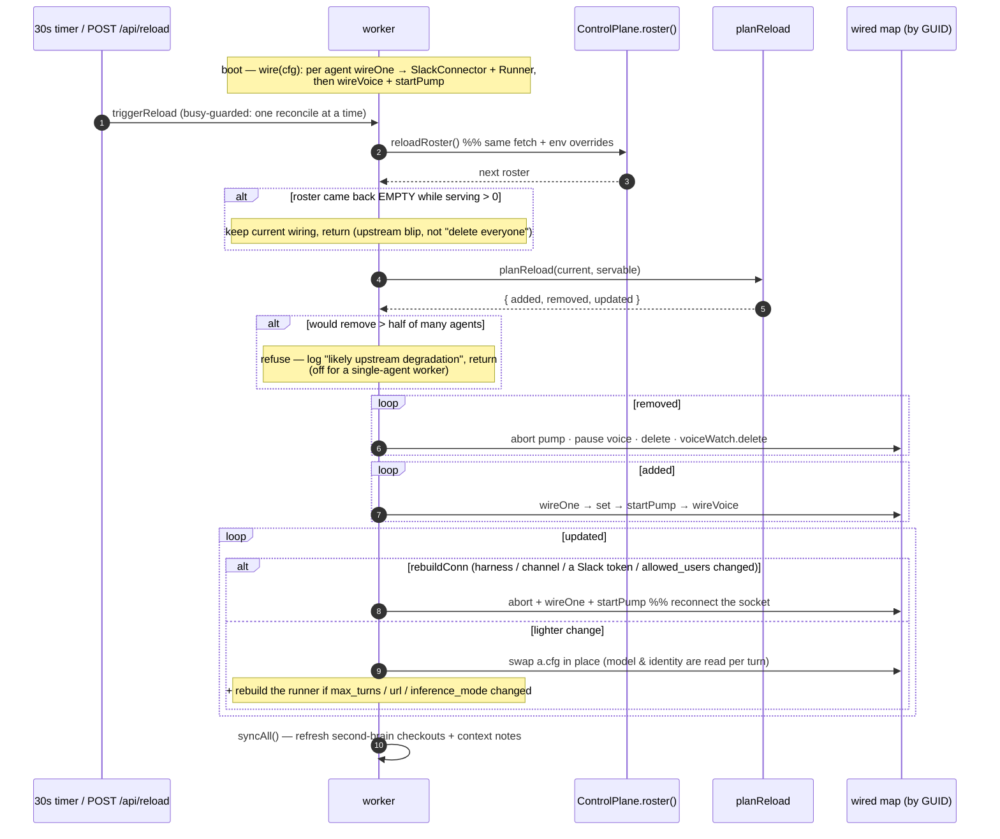

# The agent roster, identity & config plug

One gateway process runs a **roster** of agents. An agent is a **GUID-identified instance** (not a
harness type): the GUID is its stable identity, keying its config volume, its git memory, and its
registry row — so a rename in the Hub never re-keys anything. The **roster is the worker's entire view
of an agent**: a Talent, a credential, or an identity edit that isn't on the roster is one the worker
cannot see. An edit in the Hub reaches a running agent because the worker **re-fetches the roster and
reconciles**, not because anything redeploys.

This is the feature-level view of architecture.md **§A11**.

---

## Where the roster comes from

`controlPlaneFrom(env)` picks the source: `TONOMANCLOUD_API_URL` set ⇒ **`RegistryControlPlane`**
(fetches `GET /v1/system/roster`), else a **`FileControlPlane`** (a local `settings.json`). The
registry plane maps each `RegistryAgent` → `AgentConfig` through an **explicit whitelist** — `talents`,
`secondbrain`, `credentials`, model, identity text, tokens — keyed by GUID. A field added at both the
API and the worker but *missed* in this whitelist silently vanishes in between, which is the one hazard
the mapping is written to guard.

## Boot wiring, then reconcile-on-change

## The reload classifier — why a change is cheap by default

`planReload` (`src/worker/reload.ts`) keys by GUID and decides the **minimum** work:

- **`rebuildConn`** — only when a *connector input* changed (`harness`, `channel`, either Slack token,
  `allowed_users`). This is the sole path that tears down and reconnects the Socket-Mode socket.
- **`rebuildRunner`** — `rebuildConn`, or `max_turns` / `url` / `inference_mode` (fields baked in at
  construction / captured by the run closure).
- **everything else** (model, identity text) is **read per turn**, so a plain `a.cfg` swap carries it
  with no reconnect. This is why editing an agent's persona or model in the Hub lands within one reload
  and never drops its socket.

**Cadence:** a 30s timer (`ROSTER_RELOAD_SECONDS`) plus **on-demand** `POST /api/reload`, which the Hub
pokes after a write so an edit lands in about a second. The `pokeReload` caller lives on the Cloud API
side; the worker only exposes the endpoint.

---

## Corrections folded in from the code (this doc supersedes the older prose)

- **`podmanRunArgs` takes three args now, not two.** §A11 shows `podmanRunArgs(agent, cfg)`; the actual
  signature is `podmanRunArgs(a, cfg, spec)` — the harness `Spec` (from which the sandbox image is
  derived) is passed in, rather than the image being inferred from `harness` at the call site.
- **The auth-flow spec fields are lowercase.** §A11 names `LoginArgs` / `StatusArgs` / `LogoutArgs` on
  the harness Spec; the real fields are `loginArgs` / `statusArgs` / `logoutArgs`. The concept is
  intact; the capitalized symbols don't exist.
- **Only the *name* is injected into the prompt body, not the role.** §A11 says name **and** role are
  injected each turn; the verified path injects an authoritative name preamble — no role injection was
  found in the worker/harness path (the persona lives in the mounted identity file). Worth a second
  look before relying on "role is in the prompt."

> **Not stale — deliberately kept:** §A11's `skills` / `config/skills/` vocabulary is **correct**. Those
> are Claude Code **custom skills** (still called skills in code: `create agent --skill`), a different
> concept from the Wave 2/3 **skill→talent** / **connection→credential** rename, which applied to the
> *roster/voice* domain. The roster fields are already `talents` / `credentials`; A11 uses neither old
> name.

_Built on A2 (the per-agent config home + auth) and A3 (the git memory the GUID keys). The GUID is the
identity the whole worker plumbing turns on._
