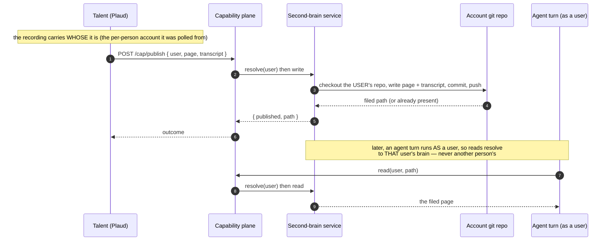

# The second brain — a per-account service

An agent's meeting recaps, notes and knowledge are filed in a **second brain**: a git-backed store
of the person's work product, distinct from the conversation transcript ([`git-memory.md`](git-memory.md),
which is per-conversation dialogue). The load-bearing decision recorded here: **the second brain
belongs to a Tonoman *account* (a person), not to an agent.** It is a **service of Tonoman** — a
runtime substrate every agent reaches through the SDK by naming *whose* brain — not a per-agent
config and not a standalone Talent.

This is the feature-level view of the store that architecture.md **§A3** touches from the memory side.
It is written and read through the capability plane the Talents use ([`tonoman-talents.md`](tonoman-talents.md)).

---

## Why per-account, not per-agent

Agents are **per-person in use**: you talk to any agent *as yourself*, on your own inference, with
your own connected accounts, over your own data. Priya talks to Nelly-as-Priya; you talk to
Nelly-as-you. A single brain keyed by the *agent* would pool everyone's meetings into one store, so
anyone talking to Nelly could read Priya's — the exact failure the per-user model exists to prevent.

Keying the brain by **account** closes that loop. The Plaud Talent, polling Priya's per-person Plaud,
files her recap in **Priya's** brain. When you open the same agent, you read **yours**. The Users tab
is per-user for the same reason: it shows what *that person* connected and can use, never a shared pool.

## The contract: a Talent names the user, the runtime resolves the brain

A Talent never holds a brain path. It calls the capability with a **`user`**, and the runtime resolves
that user's configured second-brain storage — the same per-turn resolution `configHomeFor(agent, user)`
already does for the inference login (§A2), one layer over.

The shape is the important part: **the `user` is the key, and the substrate owns the mapping** from a
user to their repo. A Talent stays ignorant of storage; the runtime stays the only thing that knows
where a person's brain lives.

## Cloud now, local later (intent only)

- **Tonoman Cloud** hosts the service today: each account's brain is a git repo the runtime provisions
  and the capability plane reads and writes. This is the only path built, and it is enough for now.
- **Local path (recorded intent, not built):** someone running Tonoman's containers on their own
  machine should still reach *their* second brain, through a **configuration they port onto that
  machine** — the same account brain, resolved locally rather than in the Cloud. The contract above is
  written so the local resolver is a drop-in behind the same `resolve(user)` seam; the mechanics (where
  the ported config lives, how it authenticates) are a later design pass.

---

## Where it sits today, and the gap this doc defines

Today the store is keyed by **agent GUID** — one brain per agent (`secondbrain/<agentGUID>/…`). The
move this document specifies is to key it by **account** and thread `user` through `publish`/read, so
the substrate resolves the right person's repo. The per-user *knobs* it depends on already exist
(per-person Plaud via `plaud_scope=per_person`, `inference_mode=per_user`); the per-account **data**
scoping is the remaining piece.

_Built on A2 (the per-turn `configHomeFor(agent, user)` resolution this mirrors) and A3 (the git
plumbing). Consumed by the Talents through the capability plane. See [[per-user-connections-and-inference]]._
