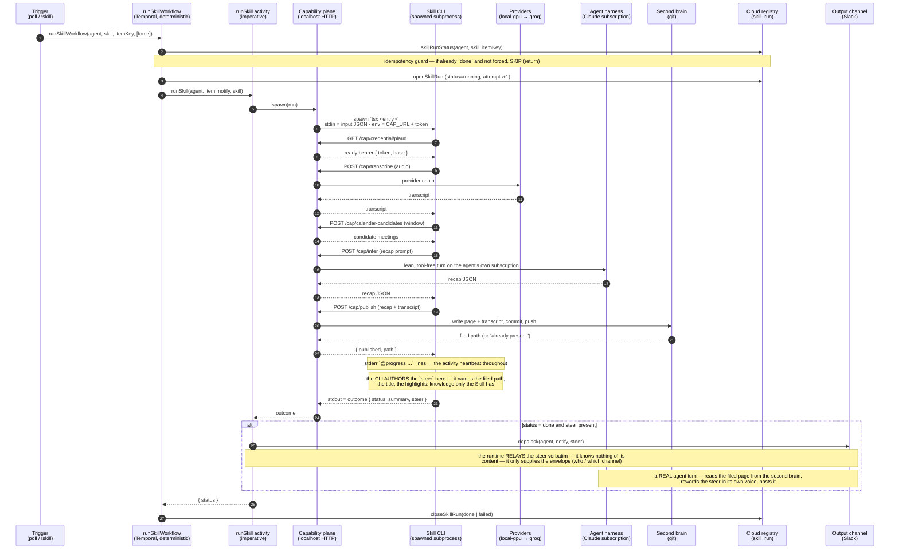

# Skills — self-contained CLIs the runtime spawns

A **Skill** is the one versioned unit an agent *runs*: it takes one item of work (a recording, a
document, an event), does something useful with it, and **reports an outcome** the runtime acts on.
The Plaud voice pipeline — transcribe a recording, summarise it against the tenant's mission, file it
in the second brain — is the first Skill and the canonical reference.

This document is the **feature-level view**: what a Skill is, how a run is wired **today**, and the
contract between the Skill and the runtime. For *building* one, see the developer guide
[`../product/skill-sdk.md`](../product/skill-sdk.md); for where Skills sit among the other
subsystems, see [`../architecture.md`](../architecture.md) (§A15 points here).

The load-bearing decision: a Skill is **code behind a manifest**, and that code is a **self-contained
CLI the runtime spawns** — not a module the worker `import()`s. The boundary is a *process* boundary,
and that one choice buys three things at once:

- **Self-contained by construction** — its own entrypoint and deps; it cannot reach into worker
  internals, so it is liftable into a separate repo unchanged.
- **Dev/prod parity** — the same CLI runs on a laptop against the developer's own credentials, or in
  Tonoman where the environment injects them. The contract is env + stdin/stdout, not a TS import.
- **Isolation as a trajectory** — running a Skill is `spawn`, so a subprocess-in-a-container today
  becomes a **per-conversation pod** later behind the *same* contract, with no redesign.

---

## The core principle: report, don't speak

A Skill **never touches Slack, never knows about "an agent," and never announces anything.** It
produces a durable artifact (for the Plaud Skill, a recap filed in the second brain) and **returns
an outcome**. The *runtime* decides what to do with that outcome — including running a real agent
turn so the **agent** tells the user, in its own words.

This is why a recap involves **two different summarisations, for two different consumers**:

| | Produced by | For | When it happens |
|---|---|---|---|
| **Structured recap** (summary, highlights, decisions, follow-ups, alignment) | the **Skill's `infer` step** | the **second brain** — the stored page | deterministically, at file time |
| **Prose announcement** (in the agent's own voice) | the **agent** (a runtime-driven turn) | the **human**, in the output channel | only if someone is notified |

The inference step is necessary **because the second brain needs a stored, structured record** — the
transcript *and* the summary become the durable artifact, independent of whether anyone is ever
notified. The announcement is a *byproduct* the agent composes **from** that stored artifact. Drop the
announcement entirely and the recap would still be inferred and filed.

---

## How a run is wired today



The two "thinking" moments are distinct and both on the **agent's own inference**: the **`infer`
capability** (a lean, tool-free turn that returns the structured recap for storage) and the
**announce turn** (a full turn, with tools, that reads the filed page and speaks). In a live run these
show up as two separate costs — e.g. `~$0.07` for the lean infer, `~$1` for the announce turn.

---

## The outcome contract — what the Skill returns, and what the agent gets

The Skill returns a **`SkillOutcome`** to the **runtime** (never directly to the agent):

```ts
{ status: "done" | "skipped" | "failed", summary?: string, steer?: string, reason?: string }
```

- **`status`** — drives the `skill_run` record and Temporal retry. `failed` is thrown so the run
  closes `failed` and retries; `skipped` says nothing.
- **`summary`** — a one-line **record** of what happened (*"Filed 'Globex…' at &lt;path&gt;, transcribed by
  local-gpu"*). For the run log / `skill_run` — **not announced, and not forwarded to the agent**.
- **`reason`** — the cause, on `skipped` / `failed`.
- **`steer`** — the **only** field that reaches the agent.

### The steer is Skill-authored, and versions with the Skill

This is the load-bearing seam. The **instruction to the agent lives in the outcome as `steer`, and the
Skill's own code writes it** — so it versions with the Skill, and changing what it says (or what it
points at) is a code change → a new Skill version. The division of labour:

- **The Skill owns the *instruction*.** Only the Skill knows its domain — *that* there is a "second
  brain," *that* it filed a "transcript," *where*, and *what* the highlights are. That knowledge is
  far too specific to live in a generic runtime, so it surfaces exactly once, in the `steer` the
  Skill authors.
- **The runtime owns only the *envelope*.** It supplies who to notify and which channel (config), and
  it runs the agent turn. It **relays the steer verbatim and understands nothing of its content** —
  a dumb, universal relay. That is why `steer` rides on the outcome rather than being composed
  runtime-side.

The runtime forwards **just the `steer`** to the agent (`deps.ask(agent, notify, steer)`). It is
**instructions, not a finished message** — *report, don't speak*. For the Plaud Skill the Skill's
code assembles:

> *"A recording has just finished processing and is filed in the second brain at `<path>`: "&lt;title&gt;".
> Write a short message telling them it is ready and giving the three most useful things from it, in
> your own words, then offer to answer questions about it. The three: (1)… (2)… (3)…"*

So the agent receives the second-brain **path**, the **title**, and the **top-3 highlights**, then
independently **reads the filed page** and **rewords it in its own voice**. Every Skill's steer will
differ — that is the point; the seam stays the same: the Skill authors the instruction into the
outcome, the runtime relays it, the agent reads the artifact and speaks.

> **Known nits (design-neutral):** the steer inlines the top-3 highlights *and* the agent re-reads the
> page (mild redundancy — the inline set is a fallback if the read fails); and `summary` is authored
> but **not yet written to the record** it names (returned and dropped) — wire it into `skill_run`
> or drop the field. Neither changes the contract.

---

## The capability plane

The environment gives a Skill two *different kinds* of things, and the split is what lets the runtime
keep control while the Skill stays self-contained:

1. **Credentials** — raw; the Skill uses them directly (Plaud: the env hands over the token, the
   Skill calls Plaud itself). `groq` is the same shape — a pluggable third party.
2. **Capabilities** — runtime-*mediated* endpoints the Skill calls through a provided
   `TONOMAN_CAPABILITY_URL` + per-run token:

| Endpoint | What it does | Whose it is |
|---|---|---|
| `POST /cap/transcribe` | audio → text over the tenant's provider chain (local-gpu → groq) | the runtime's provider layer (the SaaS/billing line) |
| `POST /cap/infer` | a **lean, tool-free** turn on the **agent's own** inference provider (its Claude subscription), NOT a side model with its own key | the agent's own plan |
| `POST /cap/publish` | writes the git-backed second brain (page + transcript, commit, push) | the runtime's brain (A3) |
| `POST /cap/calendar-candidates` | meetings in a time window, for matching | transitional runtime endpoint |
| `GET /cap/credential/<kind>` | a resolved, ready credential (e.g. a refreshable Plaud bearer) | the runtime's credential store |

**`infer` is deliberately the agent's own provider** — a recap is the agent thinking about the
meeting, on the same brain it answers with, consuming the agent's plan rather than a separate quota.

**Announcing is deliberately NOT a capability.** The Skill reports a `steer`; the durable `runSkill`
wrapper announces through the existing say path, and the agent composes the message. So a Skill never
holds a channel, and "awakening the agent" is a **runtime** responsibility, not a Skill action.

The shape of the contract: **env** carries resolved credentials + the capability URL + config;
**stdin** carries the item to work + config; **stdout** carries the outcome; **stderr** carries
`@progress` lines (a separate stream, so a large outcome can't starve the heartbeat).

---

## Temporal stays minimal: one generic activity

The worker registers exactly **one** Skill-facing activity, forever: `runSkill(name, input)`. It
spawns the CLI, streams the subprocess's `@progress` to the activity **heartbeat** (on a 20s timer too,
so a long transcription never looks dead), and returns the outcome. Temporal provides the durability —
retry, heartbeat, and the `skill_run` record that ended the 611-attempts bug — and **never knows
individual Skills.** Adding a Skill touches **neither** the worker code **nor** Temporal
registration.

### Idempotency

`runSkillWorkflow` reads the durable `skill_run` status **before spending anything**: an item
already `done` is **skipped** rather than re-transcribed and re-inferred (the fetch fails *open*, so it
can only skip a genuinely-done item, never block a new one). This dedups by **recording id** — a
re-dropped identical recording arrives with a *new* id and is a genuinely new item, so the agent, not
the guard, notices content it has seen before. `!skill <name> <id> again` bypasses the guard for a
deliberate redo.

### Trigger modes

- **Scheduled** — the poll runs every _N_ seconds (0 = off), fanning one child run per new recording,
  with a deterministic `workflowId` so a re-tick while a run is in flight is rejected, not duplicated.
- **On demand** — `!skill <name> <item>`, invoked like a tool from the agent's own channel.

---

## Configuration

A Skill's **manifest** declares its `configSchema` (typed fields: `channel` / `channel_list` /
`text` / `toggle`). Per-agent values are set in the Hub's config form and travel on the roster grant.
The Plaud Skill declares `output_channel` (where recaps announce) and `reply_in_thread` (Wave 6). The
worker reads these at wire time; an unset field falls back to the runtime default, so an unconfigured
agent behaves exactly as before.

---

## Local development

The same CLI is meant to run on a laptop. `runCli` requires a `TONOMAN_CAPABILITY_URL`; locally that
is a **dev harness** — a small local capability plane, fed from a gitignored config in the folder,
that implements each capability against the developer's own resources: transcribe from a local file or
a groq key, **`infer` via the local (already-authed) `claude` CLI**, `publish` to a local `./brain`
folder. The `steer` is handled by the local runtime too — printed to the console (optionally run
through the local `claude` to *simulate* the announcement, or posted to a dev webhook if configured),
so **no Slack is needed to build a Skill.**

_The dev harness (a `skill dev` runner + the gitignored `skill.dev.json` config shape) is a tracked
follow-up — it is not built yet. The **contract** it will target is already locked in `src/skill-sdk`,
and the developer guide ([`../product/skill-sdk.md`](../product/skill-sdk.md)) will document the
runner and config shape when they land._

---

## Layout, distribution, and the OSS / Cloud line

```
src/skills/voice/plaud-and-calendar-meetings/
  manifest.ts   # name, version, requires (credentials + capabilities), config schema
  run.ts        # the CLI: transcribe → calendar match → recap → publish → report
  index.ts      # { manifest } + the CLI entrypoint
src/skill-sdk/  # the contract: types + runCli bootstrap
```

Skills are **git repos**, integrated GitOps-style (a pinned ref → manifest + CLI). Third parties keep
their own; this repo carries the Plaud Skill as the canonical, collaborate-on-it reference. First
party gets **no shortcut** — it loads through the same external-unit path a stranger's repo would.
Running arbitrary third-party code is a risk accepted deliberately: the container is the interim
isolation boundary, the per-conversation pod the planned hardening.

- **OSS (the runtime):** the Skill runner, the SDK + capability plane (the CLI contract + the
  mediated endpoints), and the reference Plaud Skill.
- **Cloud's:** the `skill` registry (mirrored by worker-boot registration — git is the source of
  truth, the row mirrors it), install/config per agent, the routing + billing *behind* the mediated
  capabilities (this is where hosted local-gpu inference is billed), and the future marketplace +
  vetting.

_Built on A2 (sandbox boundary), A3 (git-backed second brain), A11 (per-agent config); the worker's
Temporal orchestration hosts `runSkill`. Supersedes the deleted step-interpreter model._
