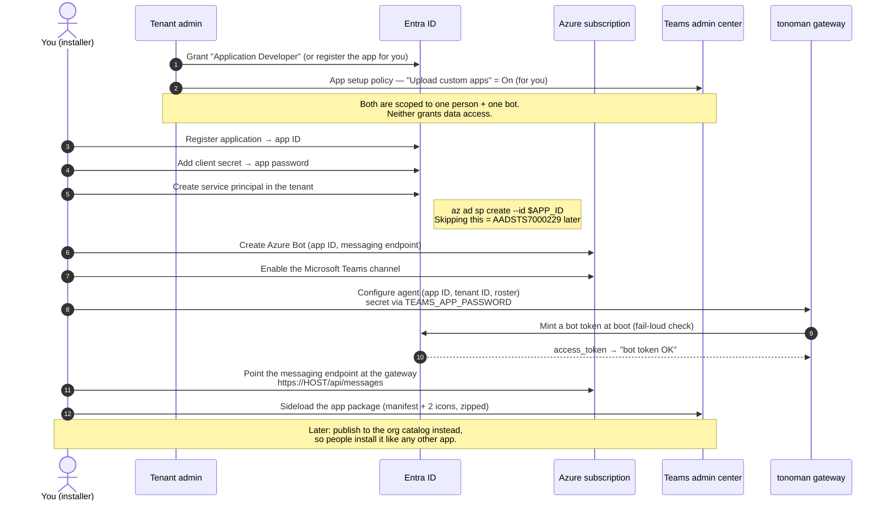
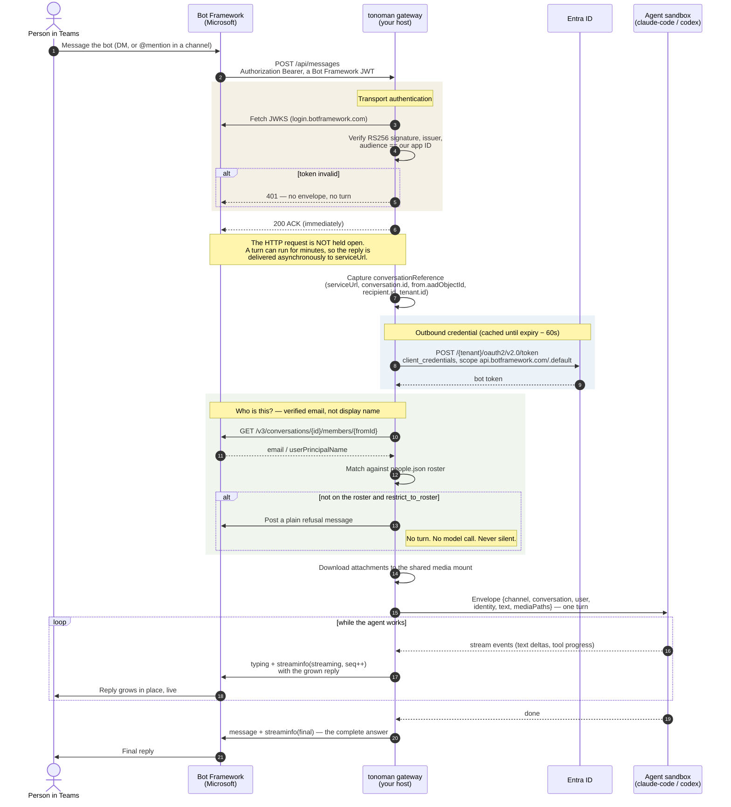

# Put an agent in Microsoft Teams

A tonoman agent can live in Teams: your team chats with it like a colleague, in DMs or a channel.
This walks through the whole setup, start to finish.

**Time:** about an hour, plus however long your tenant admin takes. **You need:** an Azure
subscription, and a Microsoft 365 tenant where someone can approve four scoped grants (Part 1 names
each console and role, so you can hand it over as one ticket). Nothing here is tonoman-specific
magic — you're registering a normal Teams bot, then pointing it at your gateway.

**How the pieces fit:** Teams sends every message to one HTTPS endpoint you control. Your tonoman
gateway answers on `/api/messages`, hands the message to the agent, and streams the reply back.
Teams never talks to the agent directly, and the agent never knows it's Teams — which is why the
same agent works on other channels unchanged.

```
Teams  →  Azure Bot  →  https://<your-host>/api/messages  →  tonoman gateway  →  agent
```

---

## How it works

Read this before Part 1 if you're the one who has to justify the setup to an IT team. It's also
the answer to "what exactly is this thing allowed to do in our tenant?"

### The moving parts

There are four, and only one of them is yours to run:

| part | who owns it | what it is |
|---|---|---|
| **Teams client + Teams service** | Microsoft | Where people type. Delivers messages to registered bots. |
| **Azure Bot** (`Microsoft.BotService`) | your Azure subscription | A routing record. Says "the bot with app ID *X* is reachable at URL *Y*." It stores no messages. |
| **Entra app registration** | your M365 tenant | The bot's identity — an app ID and a secret. **Zero Graph API permissions.** |
| **tonoman gateway** | you | The only thing that runs code. Receives activities, drives the agent, posts replies. |

The Azure Bot resource is a *pointer*, not a proxy of yours — the message path runs through
Microsoft's Bot Framework connector service, which looks up your endpoint and calls it.

### Setup — what gets created, and by whom



### Runtime — one message, end to end

This is the whole mechanism. Everything above exists so that this loop can run.



Three details in that diagram carry most of the security story:

- **The gateway authenticates every inbound POST** before it does anything else. The listener is
  internet-exposed by necessity — anyone can send it bytes — so an unsigned, expired, or
  wrong-audience token is rejected with a `401` and produces no turn. This is why `curl`-ing the
  endpoint with an empty body should return `401`, not `200` (Part 6).
- **The gateway authenticates itself outbound**, with its own client-credentials token — never the
  inbound one. Before that bearer is sent anywhere, the target `serviceUrl` host is checked against
  an allow-list (`smba.trafficmanager.net`), so a forged activity can't redirect the bot's
  credential to an attacker's server.
- **Identity comes from the verified email**, resolved from the Teams members API — never from the
  display name, which anyone in a tenant can change to anyone else's.

### What the bot can and cannot see

This is usually the question that decides whether IT says yes.

| | |
|---|---|
| **Can see** | Messages sent directly to it in a 1:1 chat. Messages that **@mention** it in a channel it has been added to. Attachments on those messages. The sender's name and email. |
| **Cannot see** | Anything in a channel it hasn't been added to. Anything in a channel it *has* been added to that doesn't @mention it. Mail. Files. SharePoint. The directory. Other people's chats. Anything at all when nobody is talking to it. |

The reason is structural, not a promise: the app registration holds **no Microsoft Graph
permissions**. There is no token in the system that could read a mailbox or a drive, because none
was ever requested or consented to. The bot's only credential is scoped to
`https://api.botframework.com/.default` — the message-routing API, and nothing else.

---

## Part 1 — Permissions you'll need

If you administer the tenant yourself, grant these and move on. If you don't, you'll need someone
who does — and this section is written so you can hand the request over without a meeting.

### The exact ask, by system

Four grants, in three different admin consoles. Naming the console and the role is what turns a
week of back-and-forth into one ticket.

| # | What you need | Where the admin grants it | Role the admin must hold |
|---|---|---|---|
| 1 | **Register an application** in Entra ID | Entra admin center → **Roles and administrators** → assign **Application Developer** to you.<br/>(Or: Entra → **User settings** → *Users can register applications* = **Yes**, tenant-wide.) | Privileged Role Administrator, or Global Administrator |
| 2 | **A service principal for that app** in the tenant | Usually implicit with #1. If `az ad sp create` is refused, the admin runs it, or holds **Cloud Application Administrator**. | Cloud Application Administrator, or Global Administrator |
| 3 | **Create the Azure Bot resource** | Azure portal → the target subscription → **Contributor** on one resource group | Owner / User Access Administrator on the subscription |
| 4 | **Upload a custom app to Teams** (*sideloading*) | Teams admin center → **Teams apps** → **Manage apps** → *Org-wide app settings* → **Custom apps** = On<br/>**and** → **Setup policies** → your policy → **Upload custom apps** = On, assigned to you | **Teams Administrator**, or Global Administrator |

Grant #4 is two switches, not one, and this is the single most common place the setup stalls: the
per-user setup policy does nothing if the **org-wide** custom-apps toggle is off. Ask for both by
name.

If a **custom app permission policy** is in force (Teams apps → **Permission policies**), custom
apps must also be *allowed* there. Most tenants leave it permissive; a locked-down one will not,
and the symptom is identical to a missing setup policy.

### What is *not* being asked for

Worth stating explicitly, because it's what the admin is actually worried about:

- **No Microsoft Graph API permissions.** Not delegated, not application, not one. No mail, no
  files, no SharePoint, no directory read. Nothing to consent to on the Graph side at all.
- **No Global Administrator for you.** Every grant above is a scoped role or a policy toggle.
- **No tenant-wide change**, except optionally #1 — and that has a per-user alternative
  (Application Developer) if the admin prefers not to flip the tenant setting.
- **No standing access.** The bot has one credential, scoped to
  `https://api.botframework.com/.default` — message routing, nothing else. Deleting the app
  registration revokes everything, instantly.

### Two traps to know before you ask

- **Guest accounts can never sideload**, no matter the policy. If your account is a guest in the
  tenant, no permission fixes it — you need a real **member** account. Check first; this determines
  whether you're asking for a policy or an account.
- Policy changes take **up to 24 hours** to reach the Teams client. If "Upload a custom app" is
  still missing after it's been granted, that's usually why. Wait; don't redo the setup.

### Networking, if the gateway runs inside the corporate network

Two directions, both narrow:

- **Inbound:** Microsoft's Bot Framework connector must reach `https://<your-host>/api/messages`
  from the public internet, on 443, with a **publicly trusted certificate**. A self-signed cert
  fails silently. This is one path on one host — not a general ingress.
- **Outbound:** the gateway needs egress to `login.microsoftonline.com` (mint the bot token),
  `login.botframework.com` (fetch the JWKS to validate inbound tokens), and
  `*.smba.trafficmanager.net` (post replies). Plus whatever the agent's model provider needs.

### Getting to production: skip sideloading

Once the agent is proven you can skip sideloading entirely by publishing it to the **org app
catalog** (Teams admin center → Manage apps → **Upload new app**), then using an app setup policy
to install or pin it for a group. People then get it like any other Teams app, and nobody needs
the sideload permission. Sideloading is the fast path to getting one person talking to it today;
the catalog is how you roll it out.

### Asking your admin

Copy this. It says what you need and — the part that usually unsticks the conversation — what you
don't.

> I'm setting up a chat assistant that runs as a bot in Teams. It's a normal Teams bot registration
> pointed at a service we run. I need four things, and I've named the console and role for each so
> you can check them off:
>
> 1. **Register an application in Entra ID** — the bot's identity. Either assign me the
>    **Application Developer** role, or register the app for me and send me the app ID and a client
>    secret. **It requires no Microsoft Graph API permissions** — no mail, no files, no SharePoint,
>    no directory. There is nothing to grant admin consent for.
>
> 2. **A service principal for that app in our tenant** (`az ad sp create --id <appId>`). This is
>    usually automatic; if it isn't, it needs **Cloud Application Administrator**. Without it the
>    bot fails with `AADSTS7000229`, which doesn't mention service principals at all.
>
> 3. **Contributor on one Azure resource group**, so I can create the Azure Bot resource. That
>    resource is just a routing record — it says "the bot with this app ID is reachable at this
>    URL." It stores no message content.
>
> 4. **Permission to upload a custom app to Teams**, so the bot appears in my client for testing.
>    In the Teams admin center this is **two** settings:
>    - **Teams apps → Manage apps → Org-wide app settings → Custom apps** = On
>    - **Teams apps → Setup policies →** (my policy) **→ Upload custom apps** = On, assigned to me
>
>    It doesn't need to be enabled for anyone else. Once the agent is approved we'd publish it to
>    the org app catalog instead, and this permission can be revoked.
>
> **What the bot can see:** only messages sent directly to it in a 1:1 chat, and messages that
> @mention it in a channel someone has explicitly added it to. It cannot read any other channel, or
> anything else in the tenant — not because we've configured it not to, but because it holds no
> Graph permissions that would let it.
>
> **Network:** it needs one inbound HTTPS path (`/api/messages` on one host, publicly reachable with
> a valid certificate) and outbound access to `login.microsoftonline.com`,
> `login.botframework.com`, and `*.smba.trafficmanager.net`.
>
> Everything above is scoped to me and to this one bot, and any of it can be revoked at any time —
> deleting the app registration kills the bot immediately.

---

## Part 2 — Register the bot

Two Azure resources: an **app registration** (the identity) and an **Azure Bot** (the connector to
Teams).

```sh
az login

# Names are yours to pick; the resource group is just a container.
RG=rg-my-agent
BOT=my-agent
az group create --name $RG --location eastus
```

**Create the app registration and its secret.**

```sh
# The app ID Teams will know the bot by.
APP_ID=$(az ad app create --display-name "$BOT" --sign-in-audience AzureADMultipleOrgs \
           --query appId -o tsv)

# The bot authenticates to Teams with this. Copy it now — Azure will not show it again.
az ad app credential reset --id "$APP_ID" --append --query password -o tsv

# REQUIRED: give the app a service principal in this tenant.
az ad sp create --id "$APP_ID"
```

That last command is easy to skip and the failure it causes is opaque — see
[Troubleshooting](#troubleshooting).

**Create the bot and turn on the Teams channel.**

```sh
az bot create --resource-group $RG --name $BOT --app-type MultiTenant \
  --appid "$APP_ID" --sku F0 --endpoint "https://example.com/api/messages"
az bot msteams create --resource-group $RG --name $BOT
```

`F0` is the free tier. The endpoint is a placeholder for now — you'll set the real one in Part 3.

Write down three values; you'll need all of them:

| value | where it came from |
|---|---|
| **app ID** | `$APP_ID` above |
| **app password** | the `credential reset` output — the one Azure won't show twice |
| **tenant ID** | `az account show --query tenantId -o tsv` |

---

## Part 3 — Give it a public HTTPS endpoint

Teams will only call a **public HTTPS URL with a valid certificate**. A self-signed cert fails
silently — the bot just never answers.

**In production:** point a DNS record at your gateway's ingress and let your cert issuer handle
TLS. Then:

```sh
az bot update --resource-group $RG --name $BOT \
  --endpoint "https://agent.example.com/api/messages"
```

**While developing,** run the gateway locally and expose it with a tunnel (`cloudflared tunnel
--url http://localhost:3979`, or the equivalent). Point the bot at the tunnel URL the same way.
Moving to production later is just re-running the command above with the real host — nothing else
changes.

---

## Part 4 — Configure the agent

Add the agent to your gateway config. The `teams` block is the only channel-specific part:

```json
{
  "agents": [
    {
      "name": "my-agent",
      "role": "what this agent is for",
      "harness": "claude-code",
      "channel": "teams",
      "teams": {
        "app_id": "<the app ID from Part 2>",
        "tenant_id": "<your tenant ID>",
        "port": 3979,
        "people_file": "/etc/tonoman/people.json",
        "restrict_to_roster": true
      }
    }
  ]
}
```

The app **password** does not go in the config — it's a secret, and it goes in the environment:

```sh
TEAMS_APP_PASSWORD=<the password from Part 2>
```

**`people_file`** is a roster mapping email addresses to names and roles, so the agent knows who
it's talking to and can address them properly:

```json
{
  "people": [
    { "name": "Dana Whitfield", "role": "Owner — the principal",
      "emails": ["dana@example.com"] },
    { "name": "Priya Raman",   "role": "Office manager — approves the work",
      "emails": ["priya@example.com"] }
  ]
}
```

Identity is resolved from the sender's **verified email**, never their display name — anyone in a
tenant can rename themselves, so trusting the display name would let one person impersonate another.

**`restrict_to_roster: true`** means only people in that file can talk to the agent. Leave it `true`
for anything that touches real data or money. Set it `false` only if you genuinely want the agent
open to everyone in the tenant.

Start the gateway. It should log that the Teams webhook is listening and the bot token is valid:

```
teams: webhook listening on :3979/api/messages
teams: bot token OK — outbound auth ready
```

If the token line is missing or errors, the password is wrong — fix that before continuing, because
nothing downstream will work.

---

## Part 5 — Install the app in Teams

Teams needs a small app package: a manifest plus two icons, zipped.

```
my-agent-app/
  manifest.json
  color.png      192×192
  outline.png    32×32, transparent, single colour
```

A minimal `manifest.json` — replace **every** `<app-id>` with the app ID from Part 2 (it appears in
three places, and missing one is the most common packaging mistake):

```json
{
  "$schema": "https://developer.microsoft.com/en-us/json-schemas/teams/v1.16/MicrosoftTeams.schema.json",
  "manifestVersion": "1.16",
  "version": "1.0.0",
  "id": "<app-id>",
  "developer": {
    "name": "Your Company",
    "websiteUrl": "https://example.com",
    "privacyUrl": "https://example.com/privacy",
    "termsOfUseUrl": "https://example.com/terms"
  },
  "name": { "short": "My Agent", "full": "My Agent" },
  "description": {
    "short": "What this agent does",
    "full": "A longer description of what this agent does."
  },
  "icons": { "color": "color.png", "outline": "outline.png" },
  "accentColor": "#2A2A2A",
  "bots": [
    {
      "botId": "<app-id>",
      "scopes": ["personal", "team"],
      "supportsFiles": true,
      "isNotificationOnly": false
    }
  ],
  "permissions": ["identity", "messageTeamMembers"],
  "validDomains": []
}
```

Zip the **contents** — not the folder:

```sh
cd my-agent-app && zip -r ../my-agent-app.zip manifest.json color.png outline.png
```

> Zipping the folder itself is the other common mistake: Teams rejects the package with a vague
> error because `manifest.json` isn't at the root of the archive.

Then in Teams: **Apps → Manage your apps → Upload an app → Upload a custom app**, and pick the zip.

If "Upload a custom app" isn't there, Part 1 hasn't taken effect — the policy is missing, hasn't
propagated yet, or the account is a guest.

Send it a message.

---

## Part 6 — Verify

**The endpoint is reachable and authenticating:**

```sh
curl -s -o /dev/null -w '%{http_code}\n' -X POST \
  https://agent.example.com/api/messages -H 'Content-Type: application/json' -d '{}'
```

**`401` is the correct answer.** It means the gateway is up, TLS is valid, and it's rejecting an
unsigned request — exactly what it should do. A `200` here would mean your bot accepts anything the
internet sends it. A timeout or `502` means Teams can't reach you either.

**The round trip:** message the agent in Teams. You should see it typing, then a reply. The gateway
logs one line per turn.

---

## Troubleshooting

**The bot never replies, and nothing appears in your logs.**
Teams can't reach your endpoint. Check the messaging endpoint is the current public URL (a dev
tunnel URL changes every restart), that it ends in `/api/messages`, and that the certificate is
real. Silent failure is the norm here — Teams will not tell you it couldn't connect.

**`AADSTS7000229`, or "Application with identifier … was not found in the directory".**
The app registration exists but has **no service principal in the tenant**. Run:

```sh
az ad sp create --id "$APP_ID"
```

This is the single most common setup failure, and the error message never says the word
"service principal".

**"Upload a custom app" is missing or greyed out in Teams.**
In order of likelihood: the **org-wide** custom-apps toggle is off (Teams admin center → Manage apps
→ Org-wide app settings → **Custom apps**) — the per-user setup policy does nothing without it; the
app **setup policy** isn't assigned to that user; the policy was assigned but hasn't propagated
(**allow up to 24 hours**); a **permission policy** blocks custom apps; or the account is a
**guest**, which can never sideload regardless of policy.

**The bot replies in a DM but is silent in a channel.**
In a channel it only sees messages that **@mention** it — that's Teams' behaviour, not a bug.
Make sure `"scopes"` in the manifest includes `"team"`.

**Replies arrive as one block instead of streaming in.**
The bot token is valid (or you'd see nothing), but the streaming path fell back. Check the gateway
log for a streaming error on the first turn of a conversation.

---

## What you end up with

An agent in Teams that knows who it's talking to, replies as it thinks, and can be given real work.
The channel is just a transport — the same agent runs on a different channel by changing one
config block, with no change to the agent itself.
